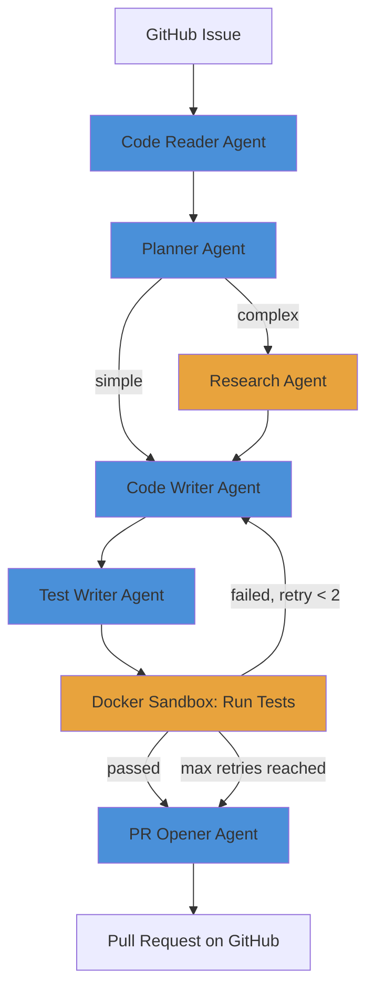

# Multi-Agent Orchestration System
A multi-agent orchestration system built with LangGraph that autonomously reads a GitHub issue, researches the codebase, generates a fix with tests, verifies the fix by running those tests in an isolated Docker container, and opens a pull request — fully automated, with no human in the loop.

## Architecture


## What Each Agent Does
| Agent | Role |
|-------|------|
| Code Reader | Analyzes code and identifies bugs, type errors, and edge cases |
| Planner | Creates a step-by-step fix plan and classifies the bug as simple or complex |
| Research Agent | Explores the wider codebase when a bug is classified as complex |
| Code Writer | Implements the fix following the plan (and prior failed test output, on retries) |
| Test Writer | Generates a full pytest test suite covering edge cases |
| Docker Sandbox | Runs the generated tests in an isolated container and reports pass/fail |
| PR Opener | Commits the fix and opens a real GitHub pull request |

## Results
- Automatically identified **3 critical bugs** in test code (type errors, float precision, negative value handling)
- Generated **15+ pytest test cases** covering normal and edge cases
- Correctly classified bug complexity and routed through the Research Agent when needed
- **Verified fixes in Docker before opening a PR**, instead of trusting untested code
- Retry loop automatically re-attempts a failing fix (capped at 2 retries) before falling back to opening the PR anyway with a clear pass/fail flag
- Opened a real GitHub PR with full review, plan, fixed code, and tests attached
- Full pipeline runs end to end from a **single command**

## Technical Decisions

**Why Docker instead of running tests directly on the host machine?**
The agent writes and executes code with no human review. Running that code directly on the host is a real security risk. Docker gives each test run a disposable, isolated environment that's thrown away after.

**Why cap retries instead of looping until tests pass?**
An LLM can get stuck failing the same way repeatedly. A hard cap (2 retries) prevents infinite loops and unbounded API cost, while still giving the system a real chance to self-correct.

**Why LangGraph over manual chaining?**
LangGraph's StateGraph allows conditional routing between agents based on live state, making the system extensible. Manual chaining is rigid and can't handle failures or alternate paths.

**Why separate agent classes?**
Each agent has a single responsibility — easier to debug, test, and swap out independently. If the Planner logic changes, only that file changes.

**Why Gemini API?**
Free tier with no credit card required, making this reproducible by anyone without upfront cost.

**Why `.env` for secrets?**
API keys and tokens never get committed to Git. The `.gitignore` excludes `.env` automatically.

## Tech Stack
- **LangGraph** — agent orchestration
- **Google Gemini 2.5 Flash** — AI reasoning for all agents
- **PyGithub** — GitHub API integration
- **Docker** — isolated test execution sandbox
- **Python 3.14** — core language
- **pytest** — generated test framework

## Running Locally
```bash
# Clone the repo
git clone https://github.com/tumer217/Multi-agent-system.git
cd Multi-agent-system

# Create virtual environment
python -m venv .venv
.venv\Scripts\activate  # Windows

# Install dependencies
pip install -r requirements.txt

# Set up environment variables
# Create a .env file with:
# GEMINI_API_KEY=your_key_here
# GITHUB_TOKEN=your_token_here

# Build the Docker sandbox image
docker build -t pytest-sandbox .

# Run the full pipeline
python workflow.py
```

## Project Structure
```
Multi-agent-system/
├── code_reader_agent.py    # Agent 1: Analyzes code for bugs
├── planner_agent.py        # Agent 2: Plans the fix, classifies complexity
├── research_agent.py       # Explores codebase for complex bugs
├── code_writer_agent.py    # Agent 3: Writes the fixed code
├── test_writer_agent.py    # Agent 4: Generates tests
├── sandbox_runner.py       # Runs tests inside Docker
├── pr_opener_agent.py      # Agent 5: Opens GitHub PR
├── Dockerfile              # Sandbox environment definition
├── workflow.py             # LangGraph orchestration
└── README.md
```