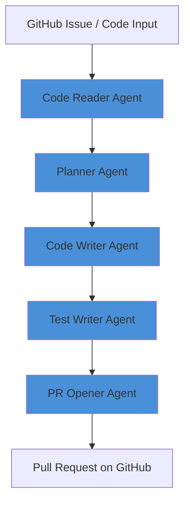

# Multi-Agent Orchestration System

A multi-agent orchestration system built with LangGraph that autonomously reads code, identifies bugs, generates fixes with tests, and opens a pull request — fully automated.

## Architecture



## What Each Agent Does

| Agent | Role |
|-------|------|
| Code Reader | Analyzes code and identifies bugs, type errors, and edge cases |
| Planner | Creates a step-by-step fix plan based on the review |
| Code Writer | Implements the fix following the plan |
| Test Writer | Generates a full pytest test suite covering all edge cases |
| PR Opener | Commits the fix and opens a real GitHub pull request |

## Results

- Automatically identified **3 critical bugs** in test code (type errors, float precision, negative value handling)
- Generated **15+ pytest test cases** covering normal and edge cases
- Opened a real GitHub PR with full review, plan, fixed code, and tests attached
- Full pipeline runs end to end from a **single command**

## Technical Decisions

**Why LangGraph over manual chaining?**
LangGraph's StateGraph allows conditional routing between agents based on live state, making the system extensible. Manual chaining is rigid and can't handle failures or alternate paths.

**Why separate agent classes?**
Each agent has a single responsibility — easier to debug, test, and swap out independently. If the Planner logic changes, only that file changes.

**Why Gemini API?**
Free tier with no credit card required, making this reproducible by anyone without upfront cost.

**Why `.env` for secrets?**
API keys and tokens never get committed to Git. The `.gitignore` excludes `.env` automatically.

## Tech Stack

- **LangGraph** — agent orchestration
- **Google Gemini 2.5 Flash** — AI reasoning for all agents
- **PyGithub** — GitHub API integration
- **Python 3.14** — core language
- **pytest** — generated test framework

## Running Locally

```bash
# Clone the repo
git clone https://github.com/tumer217/multi-agent-system.git
cd multi-agent-system

# Create virtual environment
python -m venv .venv
.venv\Scripts\activate  # Windows

# Install dependencies
pip install -r requirements.txt

# Set up environment variables
# Create a .env file with:
# GEMINI_API_KEY=your_key_here
# GITHUB_TOKEN=your_token_here

# Run the full pipeline
python workflow.py
```

## Project Structure

```
multi-agent-system/
├── code_reader_agent.py    # Agent 1: Analyzes code for bugs
├── planner_agent.py        # Agent 2: Plans the fix
├── code_writer_agent.py    # Agent 3: Writes the fixed code
├── test_writer_agent.py    # Agent 4: Generates tests
├── pr_opener_agent.py      # Agent 5: Opens GitHub PR
├── workflow.py             # LangGraph orchestration
└── README.md
```